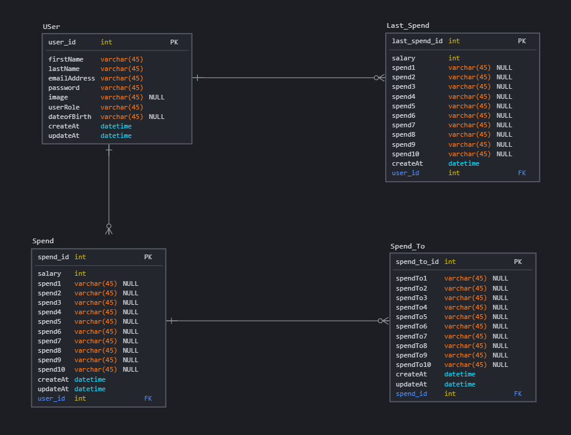

# The Spender:

This application allows the user to add his salary or any amount and divide it into several things, which helps him spend his money well.


## Important Links

- [Demo](https://youtu.be/YBQ13V3ItZw)
- [Client Repo](https://git.generalassemb.ly/adel-kalu/The-Spender)
- [Deployed API](http://thespender-env.eba-2jbixpmp.us-east-2.elasticbeanstalk.com/)
- [Deployed Client](https://pages.git.generalassemb.ly/adel-kalu/The-Spender/)

## Planning Story
Follow the planning step by step:


### User Stories

- As a user I want to sign in/up
- As a user I want to edit my profile
- As a user I want to create a new spend record
- As a user I want to read multiple spends record
- As a user I want to edit and delete a single spend record I own
- As a user I want to read multiple last spends record
- As a user I want to delete a single last spend record I own

### Technologies Used

- Java
- Spring boot
- JSON Web Tokens (jwt)
- Postman
- mySQL
- AWS
- RDS
- Git
- Git hub


### Catalog of Routes

#### User:
Verb         |	URI Pattern  | Description
------------ | ------------- |-------------
POST   | http://thespender-env.eba-2jbixpmp.us-east-2.elasticbeanstalk.com/user/registration | Sign up
POST   | http://thespender-env.eba-2jbixpmp.us-east-2.elasticbeanstalk.com/user/authenticate | Login
GET    | http://thespender-env.eba-2jbixpmp.us-east-2.elasticbeanstalk.com/user/index        | Get all user 
GET    | http://thespender-env.eba-2jbixpmp.us-east-2.elasticbeanstalk.com/user/detail?id=1  | Get specific user
PUT    | http://thespender-env.eba-2jbixpmp.us-east-2.elasticbeanstalk.com/user/edit?id=1    | Edit profilo
DELETE | http://thespender-env.eba-2jbixpmp.us-east-2.elasticbeanstalk.com/user/delete?id=1  | Delete user

#### Spend:
Verb         |	URI Pattern  | Description
------------ | ------------- |-------------
POST   | http://thespender-env.eba-2jbixpmp.us-east-2.elasticbeanstalk.com/spend/add         | Add new spend
GET    | http://thespender-env.eba-2jbixpmp.us-east-2.elasticbeanstalk.com/spend/index       | Get all spend 
GET    | http://thespender-env.eba-2jbixpmp.us-east-2.elasticbeanstalk.com/spend/detail?id=1 | Get specific spend 
PUT    | http://thespender-env.eba-2jbixpmp.us-east-2.elasticbeanstalk.com/spend/edit?id=1   | Edit spend
DELETE | http://thespender-env.eba-2jbixpmp.us-east-2.elasticbeanstalk.com/spend/delete?id=1 | Delete spend

#### Last Spend:
Verb         |	URI Pattern  | Description
------------ | ------------- |-------------
POST   | http://thespender-env.eba-2jbixpmp.us-east-2.elasticbeanstalk.com/lastSpend/add         | Add new last spend
GET    | http://thespender-env.eba-2jbixpmp.us-east-2.elasticbeanstalk.com/lastSpend/index       | Get all last spend 
GET    | http://thespender-env.eba-2jbixpmp.us-east-2.elasticbeanstalk.com/lastSpend/detail?id=1 | Get specific last spend 
PUT    | http://thespender-env.eba-2jbixpmp.us-east-2.elasticbeanstalk.com/lastSpend/edit?id=1   | Edit last spend
DELETE | http://thespender-env.eba-2jbixpmp.us-east-2.elasticbeanstalk.com/lastSpend/delete?id=1 | Delete last spend

#### SpendTo:
Verb         |	URI Pattern  | Description
------------ | ------------- |-------------
POST   | http://thespender-env.eba-2jbixpmp.us-east-2.elasticbeanstalk.com/spendTo/add         | Add new spendTo
GET    | http://thespender-env.eba-2jbixpmp.us-east-2.elasticbeanstalk.com/spendTo/index       | Get all spendTo 
GET    | http://thespender-env.eba-2jbixpmp.us-east-2.elasticbeanstalk.com/spendTo/detail?id=1 | Get specific spendTo
PUT    | http://thespender-env.eba-2jbixpmp.us-east-2.elasticbeanstalk.com/spendTo/edit?id=1   | Edit spendTo
DELETE | http://thespender-env.eba-2jbixpmp.us-east-2.elasticbeanstalk.com/spendTo/delete?id=1 | Delete spendTo

## Set up and Installation instructions
You need to add these command in pom.xml:

1. Spring Boot:
  ```
		<dependency>
			<groupId>org.springframework.boot</groupId>
			<artifactId>spring-boot-starter-data-jpa</artifactId>
		</dependency>
  ```

2. mySQL Connector:
  ```
		<dependency>
			<groupId>mysql</groupId>
			<artifactId>mysql-connector-java</artifactId>
			<scope>runtime</scope>
		</dependency>
  ```

3. Tomcat:
  ```
		<dependency>
			<groupId>org.springframework.boot</groupId>
			<artifactId>spring-boot-starter-tomcat</artifactId>
			<scope>provided</scope>
		</dependency>
  ```

4. Spring Boot Security:
  ```
		<dependency>
			<groupId>org.springframework.boot</groupId>
			<artifactId>spring-boot-starter-security</artifactId>
		</dependency>
  ```

5. Json Web Token:
  ```
		<dependency>
			<groupId>io.jsonwebtoken</groupId>
			<artifactId>jjwt</artifactId>
			<version>0.9.1</version>
		</dependency>
  ```

  
## Images

#### Wireframe:


---

#### ERD:

